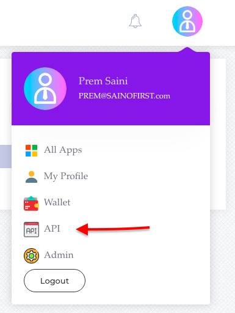
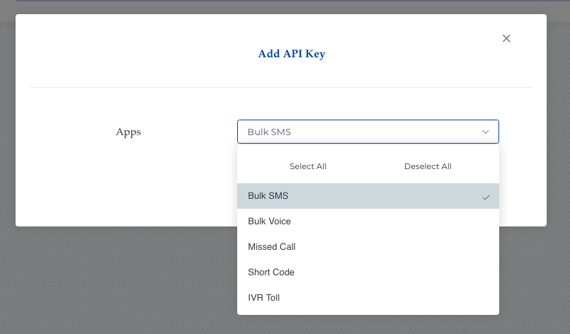

# Security & Authentication


We know Security is one of the most important thing for any application in API integration so we made sure to provide you with a set of tools that will help you create secure applications.

## 
SSL Encryption

The majority of requests to Saino First’s API require authentication. We strongly advised to use HTTPS protocol for all API requests in order to keep the submitted request secret.

## API key authorization

This is the most secure authorization with the most flexibility for any request. API keys can have a limited access and they can be revoked at any time. This range of possibilities makes API keys well suited for separating the API access rights across multiple applications or use cases. And last, the loss of an API key is easily manageable.  
 

**API keys can be generated by following the below steps.**

* To generate the API key, login to your Saino First account. Under profile click on API

* Now, In API Page click Create API

* Select the list of apps to allow access with API

Click on save, Your API key will be generated. 


You can generate multiple API\`s based on your requirement or with limited access to apps. 

Once you delete the API key, your account will be no longer accessible with old API key. 


