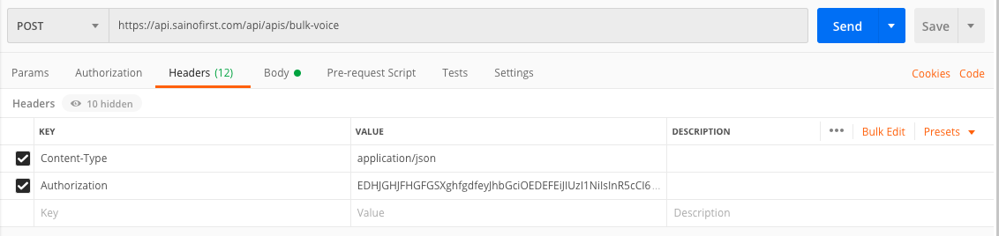
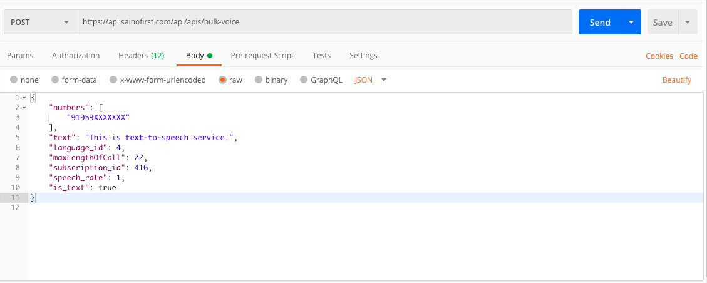

# Overview

Saino First Voice call or messaging is an automated way to call multiple numbers to deliver a voice message via call that was prerecorded or converted from a text. Also known as Voice SMS or robocalling or Voice broadcast, it delivers voice messages to any fixed or mobile phone in the world. 

**2-Factor Authentication**

It helps companies to deliver PINs for 2-Factor Authentication and transactional messages in a quicker way and ensures 100% delivery via retry methods.  

Businesses use Voice messaging to inform their customers of their latest marketing offers. It is especially effective for spreading time-sensitive messages like emergency messages, last-minute updates, to generate an opinion on a certain matter, send political campaigns etc. Voice messaging helps companies to save money because it eliminates the need for call centers to spread messages via Call.

**Voice API**

Saino First's Voice API is a simple REST API. For an originating Voice call, you submit a POST HTTP request with a well-structured body and in response, you get a confirmation from our system. 

**Testing with Postman - Use below settings**

